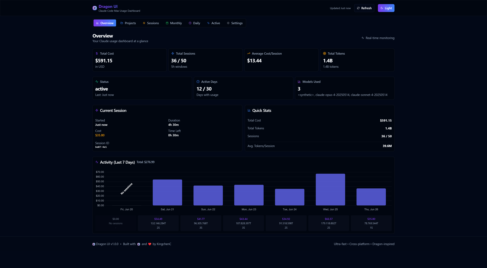
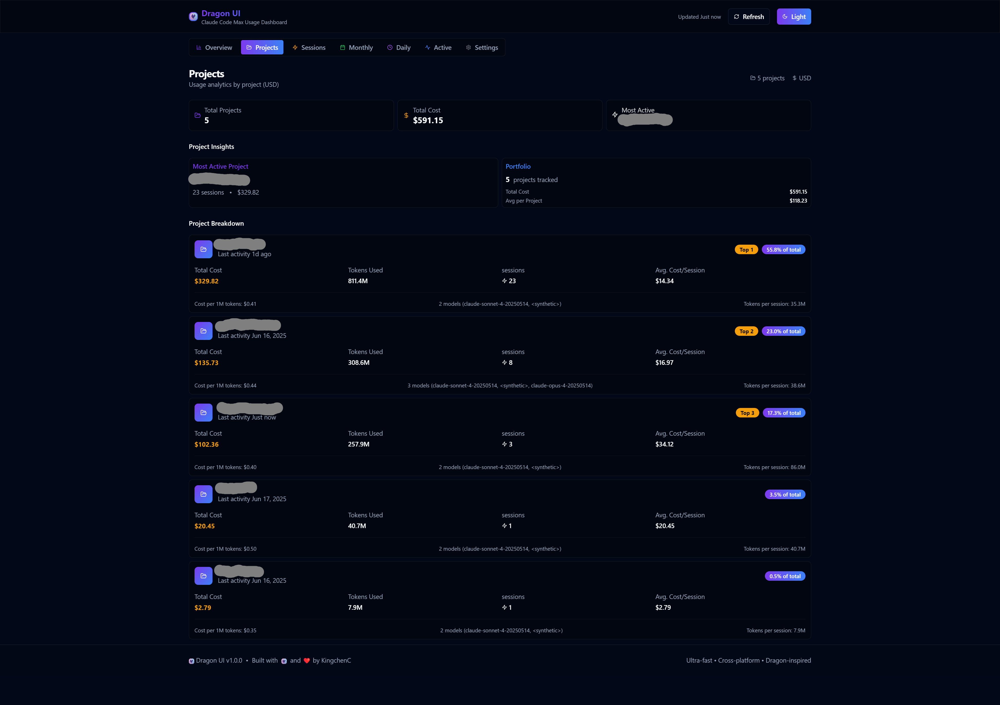
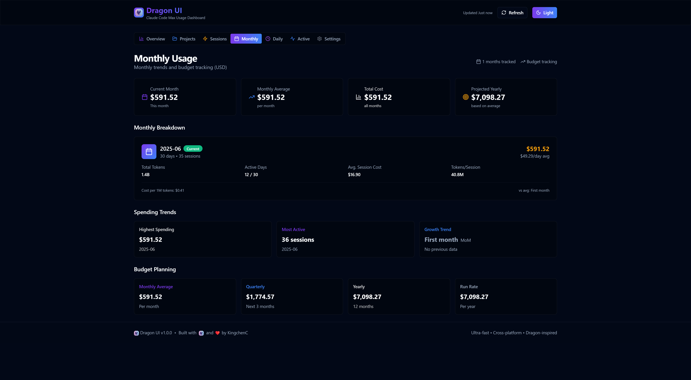
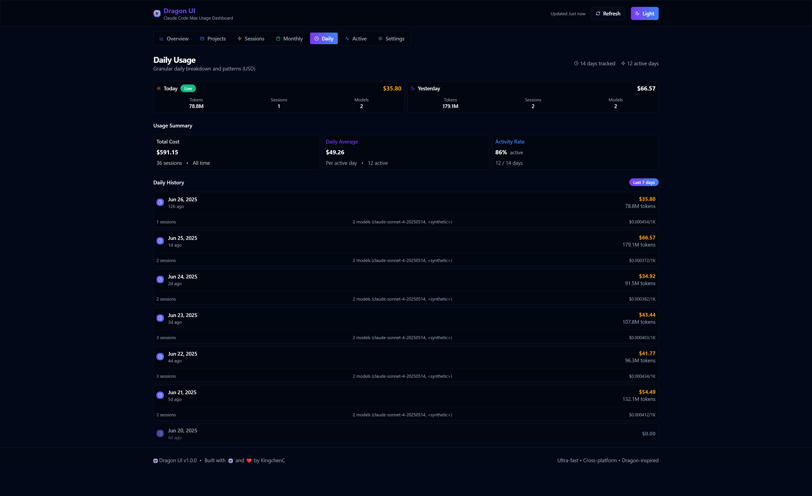
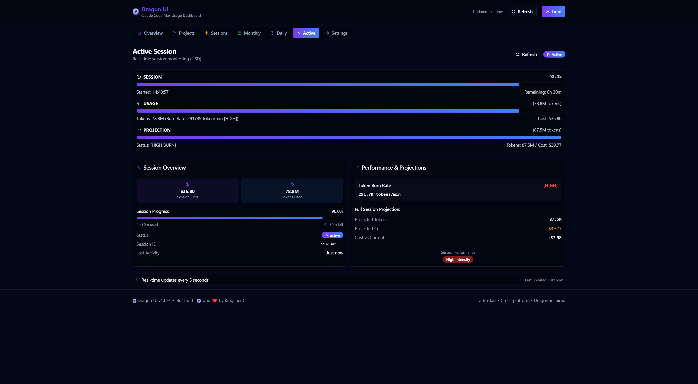
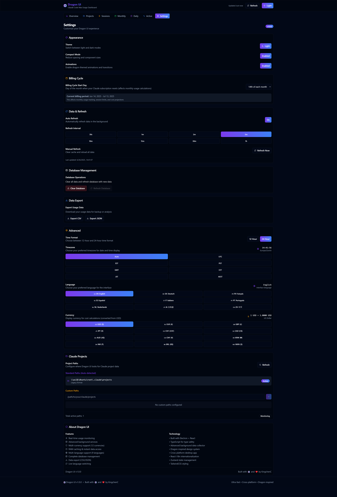

# 🐲 Dragon UI - Ultimate Claude Usage Dashboard

<p align="center">
  
</p>

> **Ultra-fast, cross-platform Claude usage dashboard with dragon-inspired design, advanced background services, multi-language support, and real-time analytics**

Dragon UI is a high-performance desktop application that provides comprehensive analytics and monitoring for Claude Code usage with built-in SQLite database, advanced worker architecture, and complete internationalization support. Built with Electron + React + TypeScript for maximum performance and user experience.


[](https://www.npmjs.com/package/dragon-ui-claude)
[](https://www.npmjs.com/package/dragon-ui-claude)

```bash
npm install -g dragon-ui-claude
```


## 📸 Screenshots

<details>
<summary>🏠 <strong>Dashboard Overview</strong></summary>
<p align="center">
  
</p>
</details>

<details>
<summary>📊 <strong>Projects Analytics</strong></summary>
<p align="center">
  
</p>
</details>

<details>
<summary>⚡ <strong>Sessions Monitoring</strong></summary>
<p align="center">
  
</p>
</details>

<details>
<summary>📅 <strong>Monthly Usage Tracking</strong></summary>
<p align="center">
  
</p>
</details>

<details>
<summary>📆 <strong>Daily Usage Analytics</strong></summary>
<p align="center">
  
</p>
</details>

<details>
<summary>🔴 <strong>Live Session Monitoring</strong></summary>
<p align="center">
  
</p>
</details>

<details>
<summary>⚙️ <strong>Advanced Settings & Configuration</strong></summary>
<p align="center">
  
</p>
</details>

## ✨ Features

### 🏆 **Advanced Architecture**
- **SQLite Database** - Lightning-fast local database with advanced queries and caching
- **Worker Thread Processing** - Heavy calculations in separate threads for smooth UI
- **Background Data Collector** - Smart async data fetching with user-configurable intervals
- **RAM Cache Service** - Ultra-fast in-memory data storage (<1ms access)
- **Multi-Currency Support** - Real-time conversion for 12 currencies with 5 API fallbacks
- **Smart Intervals** - User-defined refresh rates (30s to 1h)
- **Concurrent Processing** - Parallel data updates for maximum performance

### 🌍 **Multi-Language Support (NEW!)**
- **9 Languages Supported** - English, German, French, Spanish, Italian, Portuguese, Dutch, Japanese, Chinese
- **Live Language Switching** - Change language instantly without restart
- **Complete Translation** - Every UI element, page, and feature fully translated
- **React i18n System** - Advanced internationalization with dynamic loading
- **Persistent Language Settings** - Your language choice is remembered

### 📊 **Comprehensive Analytics Dashboard**
- **Real-time cost tracking** - Monitor current period expenses with live updates
- **Session usage metrics** - Track active and historical sessions with detailed breakdowns
- **Multi-currency display** - USD, EUR, GBP, JPY, CHF, CAD, AUD, CNY, KRW, INR, BRL, MXN
- **Daily usage trends** - Beautiful charts showing usage patterns with chronological sorting
- **Project breakdown** - Per-project cost analysis with intelligent project grouping
- **Billing cycle tracking** - Custom billing periods with accurate cost attribution

### 🏠 **Dashboard Tabs**
- **Overview** - Cost this period, session usage, daily trends, real-time monitoring
- **Projects** - Project-wise cost breakdown and analytics with smart folder detection
- **Sessions** - Active session monitoring and detailed history with 5-hour windows
- **Monthly Usage** - Monthly trends, budget tracking, and growth analysis
- **Daily Usage** - Granular daily breakdown with pattern recognition
- **Active Session** - Real-time session tracking with token burn rate monitoring
- **Settings** - Advanced customization, language selection, and database management

### 💾 **Database Management (NEW!)**
- **SQLite Integration** - Fast, reliable local database storage
- **Database Operations** - Clear, refresh, and manage your data easily
- **Data Export** - Export usage data in CSV or JSON formats for analysis
- **Backup & Restore** - Complete data management capabilities
- **Query Optimization** - Advanced SQL queries for lightning-fast analytics

### 🐲 **Dragon-Inspired Design System**
- **Dual themes** - Dark mode and light mode with system preference detection
- **Dragon aesthetics** - Subtle dragon scale patterns and flame effects
- **Advanced animations** - Smooth transitions with comprehensive disable option
- **Compact mode** - Space-efficient layout for smaller screens
- **Accessibility** - `prefers-reduced-motion` support and high contrast modes
- **Responsive Design** - Adapts beautifully to different screen sizes

### ⚡ **Technical Excellence**
- **Built-in Analytics** - Direct Claude usage tracking, no external dependencies
- **Cross-platform** - Windows, macOS, Linux support via Electron
- **Ultra-fast startup** - Background services with preload optimization
- **Type-safe** - Full TypeScript implementation with strict typing
- **Real-time updates** - Live data streaming without page refreshes
- **Worker Architecture** - Heavy computations in background threads

## 🚀 Quick Start

### Easy Installation (Recommended)
```bash
# Install globally via npm
npm install -g dragon-ui-claude

# Run Dragon UI
dragon-ui-claude

# Or run without installing
npx dragon-ui-claude
```

> **🚀 Auto-Setup Magic:** Dragon UI automatically handles all technical setup for you! The first time you run it, the app will:
> - 🔍 **Detect native modules** that need rebuilding for Electron
> - 🔧 **Automatically rebuild** `better-sqlite3` and other native dependencies 
> - 📦 **Build the app** if needed (first run only)
> - ⚡ **Launch instantly** - no manual configuration required!
>
> **Just run `dragon-ui-claude` and everything works out of the box!** 🐲✨

### Prerequisites for Development
- Node.js 18+ 
- npm or yarn

### Development Setup
```bash
# Clone the repository
git clone https://github.com/KingchenC/dragon-ui
cd dragon-ui

# Install dependencies
npm install

# Start development (Vite dev server)
npm run dev

# In another terminal: Launch Electron
npm run electron
```

### Production Build
```bash
# Build optimized production bundle
npm run build

# Test production build with Electron
npm run start

# Create distributable packages
npm run dist
```

## 🛠️ Troubleshooting

### Common Issues & Auto-Fixes

Dragon UI includes **intelligent auto-repair** that handles most issues automatically:

#### **✅ Native Module Compilation Issues (AUTO-FIXED)**
```
Error: NODE_MODULE_VERSION mismatch
```
**Auto-Fix:** Dragon UI automatically detects and rebuilds native modules for your Electron version.

#### **✅ Missing Dependencies (AUTO-FIXED)**  
```
Error: Cannot find module 'glob' or 'better-sqlite3'
```
**Auto-Fix:** All dependencies are included and automatically installed.

#### **✅ Build Issues (AUTO-FIXED)**
```
Error: dist folder not found
```
**Auto-Fix:** Dragon UI automatically builds the app on first run.

### Manual Troubleshooting

If you encounter any issues, try these steps:

```bash
# Update to latest version
npm install -g dragon-ui-claude@latest

# Force rebuild native modules
npm uninstall -g dragon-ui-claude
npm install -g dragon-ui-claude

# Check your setup
dragon-ui-claude
```

### System Requirements
- **Node.js:** 18+ (20+ recommended)
- **Operating System:** Windows 10/11, macOS 10.14+, Ubuntu 18.04+
- **Memory:** 2GB RAM minimum
- **Storage:** 500MB free space

> **💡 Pro Tip:** The EBADENGINE warnings about Node.js versions are harmless and can be safely ignored!

## 🏗️ Advanced Architecture

### Core Services

#### 1. **SQLite Database Service** 
Advanced local database with optimized queries:
```typescript
// Lightning-fast aggregations
const sessionStats = db.getSessionStats()
const monthlyStats = db.getMonthlyStats(billingCycleDay)
const dailyStats = db.getDailyStatsBySessionStart(7)

// Real-time data access
const totalCost = db.getTotalCost()
const activeDays = db.getActiveDays()
```

#### 2. **Worker Thread Processing**
Heavy calculations in separate threads:
```typescript
// Core data worker for non-blocking calculations
const worker = new Worker('./core-data-worker.cjs')
worker.postMessage({ usageEntries, currency, exchangeRates })

// UI stays responsive during heavy processing
worker.onmessage = ({ data }) => {
  updateUI(data.result)
}
```

#### 3. **Multi-Language System**
Complete internationalization with live switching:
```typescript
// 9 languages with dynamic loading
const { t, changeLanguage } = useTranslation()

// Live language switching
await changeLanguage('de') // Switch to German instantly

// Persistent settings
localStorage.setItem('dragon-ui-language', selectedLanguage)
```

#### 4. **Multi-Currency Service**
Real-time exchange rates with 5 API fallbacks:
```typescript
// 12 supported currencies
const convertedAmount = currencyService.convertFromUSD(100, 'EUR')

// CSP-compliant APIs with fallbacks
exchangerate.host → frankfurter.app → exchangerate-api.com → fallbacks
```

### Data Flow
```
Claude files → SQLite DB → Worker Thread → RAM Cache → React UI
     ↑               ↑            ↑            ↑           ↑
File watching → DB queries → Background → Zustand → Live updates
```

## 🔧 Technology Stack

### Frontend
- **React 18** - Modern UI framework with concurrent features
- **TypeScript** - Full type safety and IntelliSense
- **Vite** - Lightning-fast build tool and dev server  
- **Tailwind CSS** - Utility-first styling with custom dragon theme
- **Zustand** - Lightweight state management with persistence
- **React i18n** - Advanced internationalization system

### Backend & Database
- **SQLite** - Fast, reliable local database
- **Worker Threads** - Background processing for heavy calculations
- **Electron 28** - Cross-platform desktop app framework
- **IPC Communication** - Secure Inter-Process Communication
- **Preload Scripts** - Safe API exposure to renderer

### Advanced Services
- **Claude Analytics Engine** - Built-in Node.js integration for Claude usage analytics
- **Background processing** - Non-blocking async data collection
- **Currency APIs** - Multiple exchange rate providers with fallbacks
- **Database caching** - Optimized SQL queries with intelligent caching
- **Multi-language support** - Complete i18n system with 9 languages

### Development Tools  
- **ESLint** - Code quality and consistency
- **TypeScript** - Static type checking
- **PostCSS** - CSS processing with autoprefixer

## 📈 Performance Metrics

| Feature | Dragon UI | Traditional Apps |
|---------|-----------|------------------|
| Startup Time | <3s | 8-15s |
| Data Access | <1ms (SQLite) | 50-200ms (API) |
| Memory Usage | ~80MB | ~200MB+ |
| Currency Updates | Real-time | Manual refresh |
| Language Switching | Instant | Restart required |
| Background Processing | ✅ Non-blocking | ❌ Blocks UI |
| Database Queries | <10ms | N/A |

## 🌍 Multi-Language Support

### Supported Languages (9)
| Language | Code | Native Name | Completion |
|----------|------|-------------|------------|
| English | en | English | 100% ✅ |
| German | de | Deutsch | 100% ✅ |
| French | fr | Français | 100% ✅ |
| Spanish | es | Español | 100% ✅ |
| Italian | it | Italiano | 100% ✅ |
| Portuguese | pt | Português | 100% ✅ |
| Dutch | nl | Nederlands | 100% ✅ |
| Japanese | ja | 日本語 | 100% ✅ |
| Chinese | zh | 中文 | 100% ✅ |

### Features
- **Live Language Switching** - Change language instantly without restart
- **Complete Translation** - Every UI element, page, and message
- **Persistent Settings** - Language choice remembered across sessions
- **Fallback System** - Graceful fallback to English for missing translations
- **Dynamic Loading** - Languages loaded on demand for optimal performance

## 🎨 Dragon Theme System

### Color Palette
```css
--dragon-primary: #7C3AED;      /* Deep purple */
--dragon-secondary: #3B82F6;     /* Electric blue */
--dragon-accent: #F59E0B;        /* Gold accents */  
--dragon-flame: #EF4444;         /* Flame red */
--dragon-scale: #1F2937;         /* Dark scale */
```

### Advanced Features
- **Compact Mode**: Reduced spacing, font sizes, and component dimensions
- **Animation System**: GPU-accelerated transitions with complete disable option
- **Responsive Design**: Adapts to different screen sizes and orientations
- **Accessibility**: Full `prefers-reduced-motion` and high contrast support
- **Dragon Aesthetics**: Subtle scale patterns and flame effects

## 💰 Multi-Currency Support

### Supported Currencies (12)
| Currency | Code | Symbol | API Support |
|----------|------|--------|-------------|
| US Dollar | USD | $ | ✅ Base |
| Euro | EUR | € | ✅ Live |
| British Pound | GBP | £ | ✅ Live |
| Japanese Yen | JPY | ¥ | ✅ Live |
| Swiss Franc | CHF | CHF | ✅ Live |
| Canadian Dollar | CAD | C$ | ✅ Live |
| Australian Dollar | AUD | A$ | ✅ Live |
| Chinese Yuan | CNY | ¥ | ✅ Live |
| South Korean Won | KRW | ₩ | ✅ Live |
| Indian Rupee | INR | ₹ | ✅ Live |
| Brazilian Real | BRL | R$ | ✅ Live |
| Mexican Peso | MXN | $ | ✅ Live |

### Exchange Rate APIs (5 with fallbacks)
1. **exchangerate.host** - Primary (free, no limits)
2. **frankfurter.app** - Secondary (open source)  
3. **exchangerate-api.com** - Tertiary (free tier)
4. **freeforexapi.com** - Quaternary (backup)
5. **currencyapi.com** - Final fallback

## 💾 Database Management

### SQLite Features
- **Lightning-fast queries** - Optimized SQL for instant results
- **Local storage** - No external dependencies or cloud requirements
- **Data integrity** - ACID compliance with transaction support
- **Backup support** - Easy data export and import
- **Schema management** - Automatic database migrations

### Database Operations
```typescript
// Advanced database operations
db.clearDatabase()        // Clear all data
db.refreshDatabase()      // Reload from Claude files
db.exportData('csv')      // Export to CSV
db.exportData('json')     // Export to JSON
db.getDbInfo()           // Database statistics
```

## ⚙️ Advanced Settings

### Appearance
- **Theme**: Dark/light mode with system preference detection
- **Language**: 9 supported languages with live switching
- **Compact Mode**: Space-efficient layout for smaller screens
- **Animations**: Full control with accessibility support

### Data & Refresh
- **Auto Refresh**: Background data updates with configurable intervals
- **Manual Refresh**: On-demand data refresh with cache clearing
- **Billing Cycle**: Custom billing periods (1st-31st of month)
- **Database Management**: Clear, refresh, and export capabilities

### Advanced Options
- **Currency**: 12 supported currencies with live conversion
- **Time Format**: 12h/24h with timezone support
- **Project Paths**: Custom Claude project directory detection
- **Export Options**: CSV and JSON data export formats

## 🛠️ Development Commands

```bash
# Development
npm run dev          # Start Vite dev server (port 5173)
npm run electron     # Launch Electron app

# Building  
npm run build        # Production build
npm run start        # Test production build

# Code Quality
npm run lint         # ESLint check
npm run lint:fix     # Auto-fix ESLint issues

# Electron Distribution
npm run electron:pack    # Package without installer
npm run dist            # Create installer/DMG/AppImage
```

## 📁 Project Structure

```
dragon-ui/
├── src/
│   ├── components/          # Reusable UI components
│   │   ├── ui/             # Base UI components
│   │   ├── dashboard/      # Dashboard-specific components
│   │   └── charts/         # Chart components
│   ├── pages/              # Dashboard tabs
│   ├── i18n/               # Internationalization
│   │   ├── locales/        # Translation files (9 languages)
│   │   ├── languages.ts    # Language definitions
│   │   └── index.ts        # i18n system
│   └── lib/                # Core services
│       ├── store.ts        # Zustand state management
│       ├── currency-service.ts  # Multi-currency support
│       ├── hooks.ts        # Custom React hooks
│       └── utils.ts        # Utility functions
├── services/               # Backend services
│   ├── core-data-worker.cjs    # Worker thread calculations
│   ├── database.cjs            # SQLite database service
│   ├── data-loader.cjs         # Data loading service
│   └── path-manager.cjs        # Claude path management
├── main.cjs               # Electron main process
├── preload.cjs           # Electron preload script
├── usage.db              # SQLite database file
└── package.json          # Dependencies and scripts
```

## 🔐 Advanced Database Integration

Dragon UI uses SQLite for lightning-fast local data processing:

```typescript
// Advanced SQL queries with worker thread processing
class DatabaseService {
  getSessionStats() {
    return this.db.prepare(`
      SELECT session_id, SUM(cost) as total_cost, 
             COUNT(*) as entry_count,
             MIN(timestamp) as start_time,
             MAX(timestamp) as end_time
      FROM usage_entries 
      WHERE session_id IS NOT NULL
      GROUP BY session_id
      ORDER BY start_time DESC
    `).all()
  }
  
  getMonthlyStats(billingCycleDay) {
    // Complex billing period calculations
    // Custom date grouping based on billing cycle
    // Currency conversion in SQL
  }
}
```

## 🤝 Community & Contributing

### 🌟 Community-Driven Development

Dragon UI is a **community-driven project** built by developers, for developers! We believe in the power of open-source collaboration and welcome contributions from everyone.

### 💝 Why Contribute?

- **Make a difference** - Help thousands of Claude users worldwide
- **Learn and grow** - Work with modern technologies (React, TypeScript, Electron, SQLite)
- **Build your portfolio** - Contribute to a high-quality, production-ready application
- **Shape the future** - Your ideas and features can impact the entire community

### 🚀 How to Contribute

We welcome all types of contributions:

#### 🐛 **Bug Reports & Feature Requests**
- Found a bug? Create an issue with detailed reproduction steps
- Have an idea? Share it in our discussions or create a feature request
- All feedback helps make Dragon UI better!

#### 💻 **Code Contributions**
- **New features** - Multi-language support, new chart types, advanced analytics
- **Bug fixes** - Help resolve issues and improve stability  
- **Performance optimizations** - Database queries, UI responsiveness, memory usage
- **UI/UX improvements** - Better design, accessibility, user experience
- **Documentation** - Code comments, README updates, tutorials

#### 🌍 **Internationalization**
- **New languages** - Help us support more languages
- **Translation improvements** - Fix or enhance existing translations
- **Cultural adaptations** - Make the app feel native in different regions

#### 🎨 **Design & Assets**
- **UI improvements** - Better layouts, icons, visual elements
- **Theme variations** - New color schemes, dragon-inspired designs
- **Accessibility** - High contrast modes, better keyboard navigation

### 🛠️ **Development Areas**

We're actively looking for contributors in these areas:

- **Database optimization** - Advanced SQL queries, caching strategies
- **Worker thread performance** - Background processing improvements
- **Multi-platform support** - macOS and Linux specific features
- **Chart enhancements** - New visualization types, interactive features
- **Mobile responsiveness** - Better support for different screen sizes
- **Plugin system** - Extensible architecture for community plugins

### 📝 **Getting Started**

1. **Fork the repository** and clone it locally
2. **Set up the development environment** (see Quick Start guide)
3. **Pick an issue** labeled `good first issue` or `help wanted`
4. **Make your changes** following our coding standards
5. **Test thoroughly** - ensure everything works across platforms
6. **Submit a pull request** with a clear description

### 💬 **Join Our Community**

- **GitHub Discussions** - Share ideas, ask questions, get help
- **Issue Tracker** - Report bugs, request features
- **Pull Requests** - Contribute code, documentation, translations

### 🎯 **Contribution Guidelines**

- **Code Quality** - Follow TypeScript best practices, use ESLint
- **Testing** - Test your changes across different platforms
- **Documentation** - Update README and code comments as needed
- **Respect** - Be kind, constructive, and welcoming to all contributors

---

**Feel free to contribute, no matter your skill level!** Whether you're fixing a typo, adding a translation, or building a major feature - every contribution matters and helps make Dragon UI better for everyone.

**Ready to contribute?** Check out our [open issues](https://github.com/KingchenC/dragon-ui/issues) to get started!

## 📄 License

MIT License - see [LICENSE](LICENSE) file for details.

## 🙏 Acknowledgments

- Built with inspiration from the amazing Claude development community
- [Electron](https://electronjs.org/) - Fantastic cross-platform desktop framework
- [React](https://reactjs.org/) - Modern UI framework
- [Tailwind CSS](https://tailwindcss.com/) - Utility-first CSS framework
- [SQLite](https://sqlite.org/) - Reliable, fast local database

---

**Built with 🐲 and ⚡ by KingchenC**

*Ultra-fast • Cross-platform • Multi-language • Database-powered • Community-driven*

<p align="center">
  
</p>
